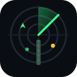

<div align="center">



# DCS Web GCA

**Web-based ATC console (GCA / GCI / TWR) for DCS World dedicated servers**

</div>

DCS World Dedicated Server 向けのブラウザベース管制コンソールです。
導入済みの **Tacview** のリアルタイム ACMI テレメトリストリームを TCP で受信し、WebSocket 経由でブラウザ上の管制画面に配信します。

## アーキテクチャ

```
[DCS Dedicated Server] --(Tacview addon)--> [ACMI real-time stream :34250/TCP]
        |
        v
[dcs-web-gca (Node.js)]  -- ACMI 2.2 パース -> 機体状態管理 -> 管制誘導計算
        |
        +-- HTTP  : 静的ファイル + REST API (/api/config, /api/state)
        +-- WS    : /ws で 5Hz スナップショット + トークダウンログ配信
        |
        v
[ブラウザ] GCA / GCI / TWR の 3 モード切替コンソール
```

- DCS 側の追加設定は不要 (Tacview 導入済みならそのまま利用可能)
- Tacview リアルタイム配信が有効であること (DCS 用 Tacview アドオンの設定で確認)

## 管制モード

| モード | 概要 |
|---|---|
| **GCA (PAR)** | 精密進入レーダー。方位スコープ + 仰角スコープ + トークダウン指示 (FLY LEFT / COMING HIGH 等)。**リアルタイム音声式誘導文** ("Viper-1, 5.2 miles from touchdown, on course, on glidepath, altitude should be 1900 feet.") を自動生成し Talk-down Log に表示 |
| **GCI** | 迎撃管制。PPI レーダースコープ (10/20/40/80 nm 切替、速度ベクトルリーダー付き)。自機 (OWN) と目標 (TARGET) を指定すると直線迎撃ソリューション (STEER / CLOSURE / TTI) を表示 |
| **TWR** | 飛行場管制。滑走路・進入センターラインを描画した 6 nm スコープと場周トラフィック一覧 |

LotAtc 等の他の管制ソフトを参考にした機能構成です。ブラウザ上でタブ切替により利用できます。

## ローカル開発

```bash
npm install

# ターミナル1: モックTacviewサーバーを起動
npm run mock

# ターミナル2: GCAサーバーをモックに接続して起動
# PowerShell:
$env:TACVIEW_PORT=34251; npm start
# bash:
TACVIEW_PORT=34251 npm start
```

http://localhost:8080 を開くと、模擬進入機が PAR スコープに表示されます。

統合スモークテスト:

```bash
npm run smoke
```

## 本番デプロイ (Ubuntu)

### 1. インストール

```bash
sudo mkdir -p /opt/dcs-web-gca
sudo chown $USER /opt/dcs-web-gca
git clone https://github.com/MasterMk2/DCSWebGCA.git /opt/dcs-web-gca
cd /opt/dcs-web-gca
npm install --omit=dev
cp config/config.example.json config/config.json
```

### 2. 設定

`config/config.json` を編集:

- `tacview.host` / `tacview.port`: DCS サーバー上の Tacview リアルタイムポート (既定 34250)。
  Web サーバーを別ホストに置く場合は DCS 側ファイアウォールで TCP 34250 を開放してください。
- `tacview.password`: Tacview のリアルタイム配信にパスワードを設定している場合は記入。
- `gca.runways`: 管制対象の滑走路を緯度経度・標高・方位・グライドパス角・長さ (`lengthNm`) で定義 (複数可)。

### 3. Docker で実行する場合

公式イメージを GHCR から取得して起動できます (main ブランチ push 時に GitHub Actions が自動ビルド):

```bash
mkdir -p config
cp config/config.example.json config/config.json   # リポジトリを clone した場合
vi config/config.json                              # 滑走路定義などを編集

docker compose up -d
```

- `docker-compose.yml` は `ghcr.io/mastermk2/dcswebgca:latest` を使用します
- DCS + Tacview が同一ホストの場合は `TACVIEW_HOST=host.docker.internal` のままで OK (`extra_hosts: host-gateway` 済み)
- 別ホストの DCS サーバーに接続する場合は `TACVIEW_HOST` にその IP を指定
- 設定は `./config` をボリュームマウントして反映
- 手動ビルドの場合: `docker build -t dcs-web-gca . && docker run -p 8080:8080 -v ./config:/app/config:ro dcs-web-gca`

nginx からのプロキシ先を `http://127.0.0.1:8080` にするだけで、以降の手順 (nginx 設定) は systemd 版と共通です。

### 4. systemd 登録 (Docker 不使用の場合)

```bash
sudo cp deploy/dcswebgca.service /etc/systemd/system/
sudo systemctl daemon-reload
sudo systemctl enable --now dcswebgca
```

### 5. nginx (HTTPS)

既存の HTTPS server ブロックに `deploy/nginx-gca.conf` の内容を取り込みます:

```bash
sudo nginx -t && sudo systemctl reload nginx
```

`https://<your-domain>/gca/` でアクセス可能になります (wss も同経路でアップグレードされます)。

## API

| エンドポイント | 内容 |
|---|---|
| `GET /api/config` | 滑走路定義・Tacview 接続状態 |
| `GET /api/state` | 現在のトラックスナップショット (REST フォールバック) |
| `WS /ws` | `hello` / `tracks` / `transcript` / `runwayChanged` メッセージ配信。`{"type":"selectRunway","runway":"..."}` で基準滑走路を切替 |

## 誘導ロジック

滑走路末端 (threshold) を原点とした平面近似で、各機について以下を計算します:

- **RNG**: 末端からの距離 (nm)
- **AZ DEV**: 進入コースに対する方位偏差 (deg, R/L)
- **GS DEV**: グライドパス角に対する仰角偏差 (deg, HIGH/LOW)
- **Guidance**: `ON COURSE / FLY LEFT / FLY RIGHT` × `ON GLIDEPATH / COMING HIGH / COMING LOW`
- **Talk-down 文**: 初回接触時・偏差状態変化時・15 秒ごとに PAR 型誘導文を自動生成

しきい値: 方位 ±0.8°、グライドパス ±0.4° 以内で ON。

## ライセンス

MIT
